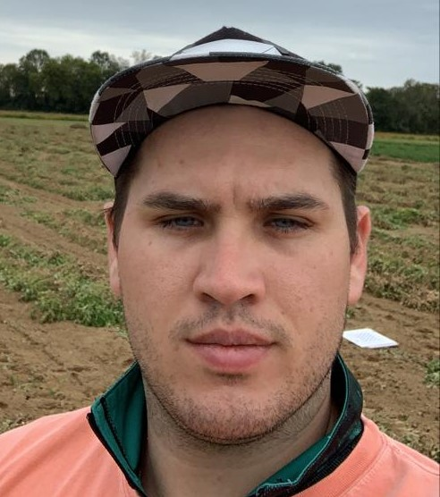

I am a graduate student at <a href="/">Auburn University</a> where I am pursuing a PhD at the <a href="/">Biosystems Engineering Department</a> where I am researching applications of machine learning and deep learning to agriculture problems with my advisor <a href="/">Dr. Yin Bao</a>. I have received my BS in Electronics Engineering and my MS in Electrical Engineering from the Federal University of Santa Catarina (Brazil) where I was advised by <a href="/">Jefferson Brum Marques</a> and <a href="/">Djones Lettnin</a> respectively.

I have experience designing HW and integrating with SW for projects for the academia and the industry. More recently, I have been working on robotics, machine learning and deep learning for computer vision. I am currently working on projects that speed up breeding research trials using of deep learning as a tool for high-throughput plant phenotyping.

On my spare time I enjoy to practicing <a href="/">Brazilian Jiu-Jitsu</a>, working on DIY projects and playing old computer games.

---

# Publications
- **Ultra-wideband Joint Spatial Coding for Secure Communication and High Resolution Imaging**\
Himanshu Aggrawal, **Rafael Puhl**, Christoph Studer, Aydin Babakhani. TMTT2017
- **Ultra-wideband pulse-based directional modulation**\
Himanshu Aggrawal, **Rafael Puhl**, Aydin Babakhani. IMARC2015 (Best Paper Finalist 4th place)

# Preprints
- **Temporal Leaf Matching of Maize Plants using a Siamese Neural Network and Hungarian Algorithm**\
**Rafael Bidese**, Yin Bao, Lie Tang. TBD 2021
- **Peanut detection, tracking and counting using deep neural networks**\
**Rafael Bidese**, Yin Bao, Alvaro Sanz-Saez, Charles Chen. ASABE AIM2021

# Awards and Honors


Matched with other graduate students and a Google researcher to discuss academic and industry work.



Invited to join The Honor Society of Agricultural, Food, and Biological Engineering. Offered to outstanding graduate students in biological and agricultural engineering.



Awarded a full scholarship that covered monthly stipend during the MS studies 2015-2017.



Awarded a full scholarship that covered tuition, transportation, necessary materials and living costs to study 2 academic semesters at Rice University.



Awarded a full scholarship that covered monthly stipend during the BS studies 2010-2012.


---

You may reach me at: rafael at auburn dot edu